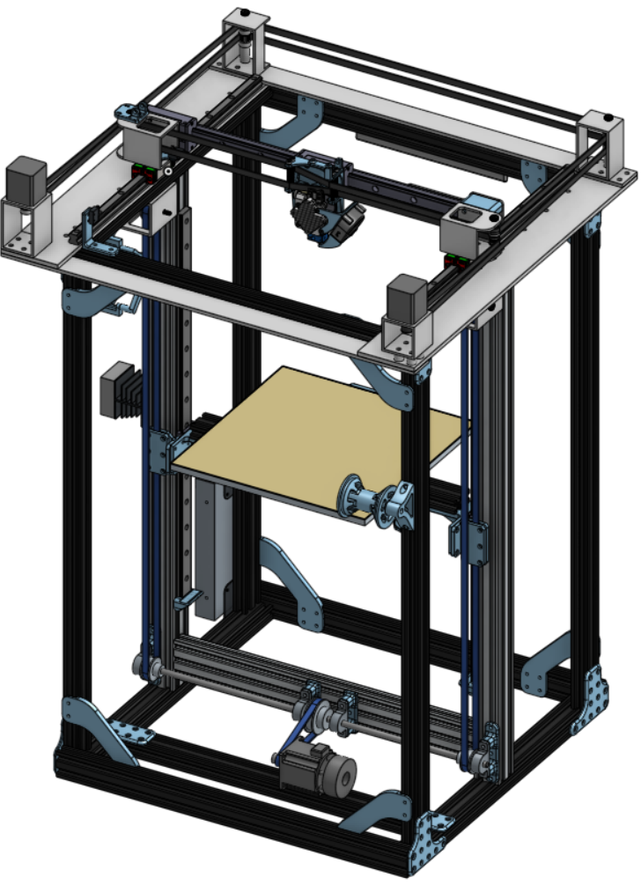

# Bobby-B-Bot

Documentation, plans, and files  for the Bobby-B-Bot.
## Table of Contents
| Topic  | Resource |
|:------:|:--------:|
|Overview|[Link](README.md)  |
|BOM     |[Link](Documentation/01_BOM.md)  |
|Parts   |[Link](Documentation/Parts/02_Parts.md) |
|Configuration| [Link](Documentation/) |
|Write-up| [Link](Documentation/) |

## Overview
The design intent with the Bobby-B-Bot was to create a robust motion platform that can be configured for a number of applications such as 3D printing, milling, plotting, and laser etching. For the most part it was designed with 3D printing and light milling operations in mind. 
### 3D printer Design Intent:
1. Core XY Kinematics
2. Rigid Frame
3. Ability to convert to mill for light milling capability
4. Linear rails 
5. Belted bed
6. Z-Stepper w/ brake
7.  Aluminum for all major parts of the motion platform
8. Swappable Bed for 3D printing or milling
9. 300mm^2 build plate 
10. 120v AC bed heater

